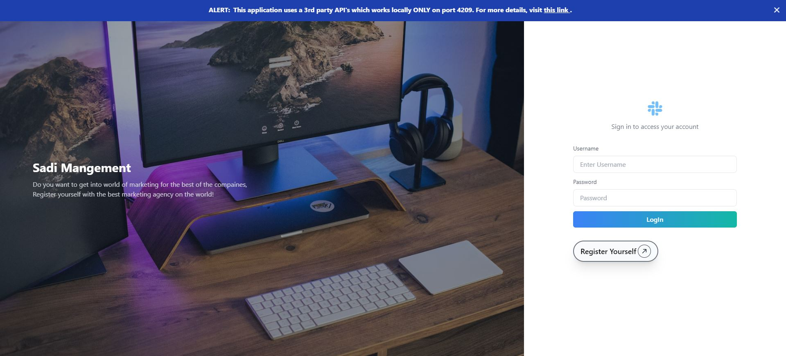

# User Management V 1.0



## Overview

User Management V 1.0 is an Angular and TypeScript-based web application enhanced with improved UI/UX and modern features. It offers functionalities for user and admin management, video content administration, and interactive analytical dashboards. The application is responsive, API-integrated, and built with scalability in mind.

## Features

- **Authentication:**
  - Signup and login functionality.

- **User/Admin Dashboard:**
  - Interactive analytical charts using ag-charts.

- **User Management:**
  - View all users/students in a user list.
  - Edit and update user details.
  - Add new students via a dynamic form.

- **Video Management:**
  - View admin-recommended video lists.
  - Add new videos through a dedicated form.

- **Mobile Responsive Design:**
  - Optimized for all devices.

- **API Integration:**
  - Fully integrated with a third-party backend.

- **RxJS Mastery:**
  - Real-time data flow and handling using RxJS.

## Technologies Used

- **Frontend Framework:** Angular + TypeScript
- **Charts:** ag-charts
- **Styling:** CSS and Angular Material
- **State Management:** RxJS for reactive programming

## Installation

To run the Carto Frontend locally, follow these steps:

1. Clone the repository:
   ```bash
   git clone https://github.com/Place4you/userManagement.git
   
2. Install Dependencies:
   ```bash
   npm install

3. Start the application on port 4209 for backend API integration:
   ```bash
   ng serve --port 4209


## Usage
Open the application in your browser:
   http://localhost:4209
1. Navigate to the application URL in your web browser.
2. Sign up for a new account or log in with existing credentials.
3. Explore features such as:
+ Viewing and managing users/students.
+ Interacting with the analytics dashboard.
+ Managing video recommendations.

## Contributing

Contributions are welcome! If you'd like to contribute to Carto, please follow these steps:

1. Fork the repository.
2. Create a new branch for your feature or bug fix: `git checkout -b feature-name`
3. Make your changes and commit them: `git commit -m "Add new feature"`
4. Push to your branch: `git push origin feature-name`
5. Submit a pull request detailing your changes.

## License

This project is licensed under the [MIT License](LICENSE).

## Contact

For any inquiries or support, please contact sadiraja500@gmail.com.
